# Amazon SageMaker AutoPilot No-code-workshop
*No code workshop to experiment on Amazon SageMaker AutoPilot*

Introduction: Amazon SageMaker Autopilot automatically builds, trains, and tunes the best machine learning models based on your data, while allowing you to maintain full control and visibility.

 
## Download data
[This CSV file](data/churn.csv) includes customer churn data.

We use an example of churn that is familiar to all of us–leaving a mobile phone operator. Seems like I can always find fault with my provider du jour! And if my provider knows that I’m thinking of leaving, it can offer timely incentives–I can always use a phone upgrade or perhaps have a new feature activated–and I might just stick around. Incentives are often much more cost effective than losing and reacquiring a customer.

## Uploading the CSV file to S3 bucket
Amazon SageMaker imports the training data from any S3 bucket: 
<!-- let's create one to store the CSV file downloaded earlier. -->

1. Access the S3 management console by typing S3 as shown below:

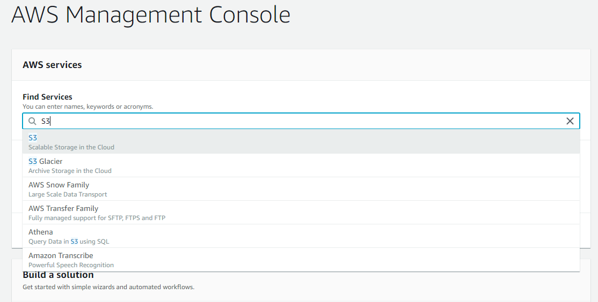
 

1. Click on the name of the bucket

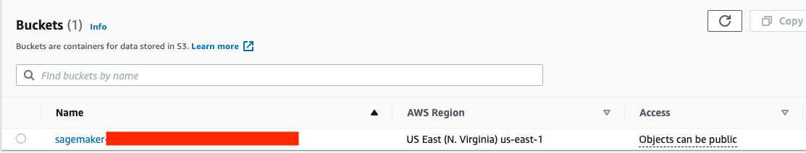 

3. Press **Upload**

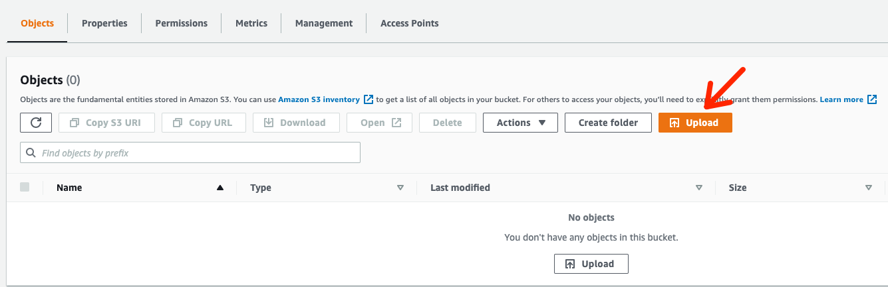

4. Select `churn.csv` downloaded earlier by  clicking the **Add files** button.

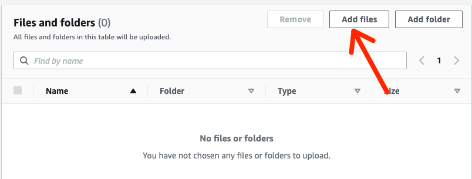

5. Click the **Upload** button at the bottom left of the screen to start uploading.

## Go to the SageMaker screen by selecting its name from the list of services

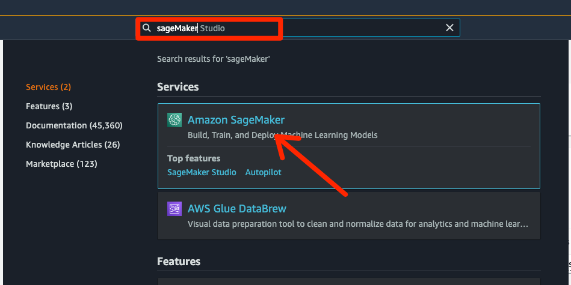

1. Click on **SageMaker Studio** button on the welcome screen:

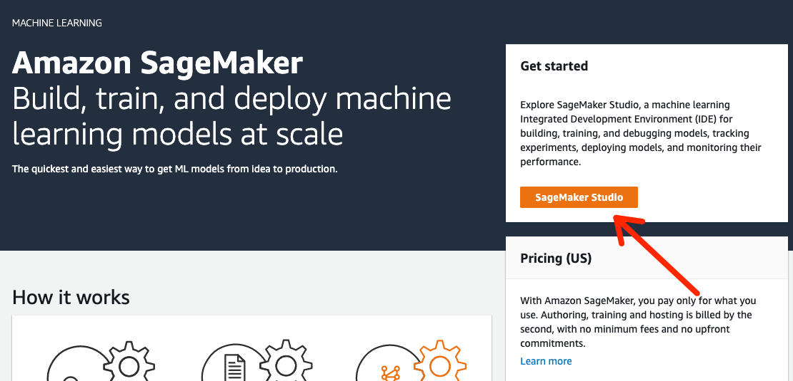

Then, press **Open Studio** on the interface below: 

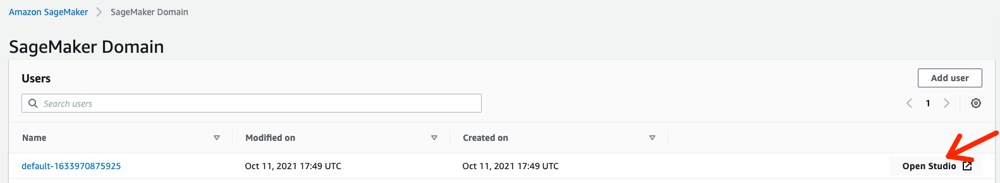

2. From the left menu, click **SageMaker resources**, and from the SageMaker dropdown list, click   **Experiments and trials**:

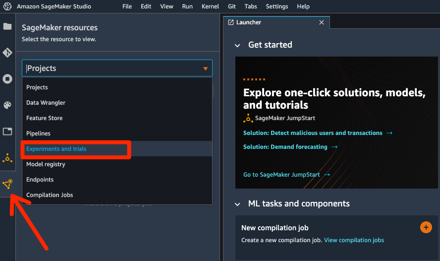

3. Click on  **Create Autopilot Experiment**:

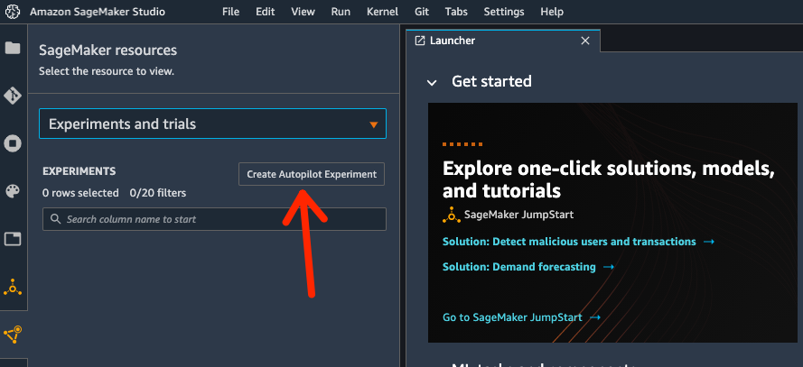

4. Input the required info, namely, the name of teh experiment, target column name, location of the data in Amazon S3, location of the output. 

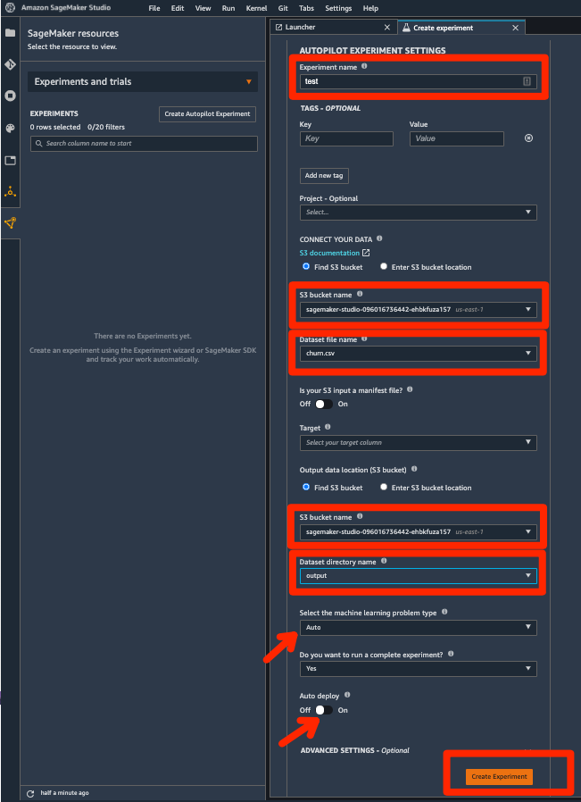

Next, Click  **Create Experiment**.

5. You will see a new window showing the steps to be completed and also a realtime view of the job status. 
   
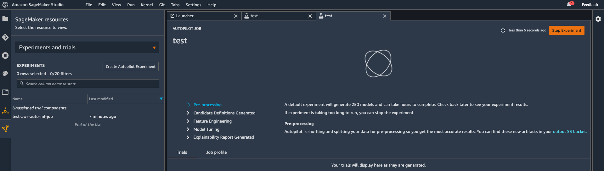

6. Once Pre-processing, Candidate Definitions Generated, and Feature Engineering steps are completed and **Model Tuning** started, you can track all the training jobs and see the model names, status, and obkective values: 

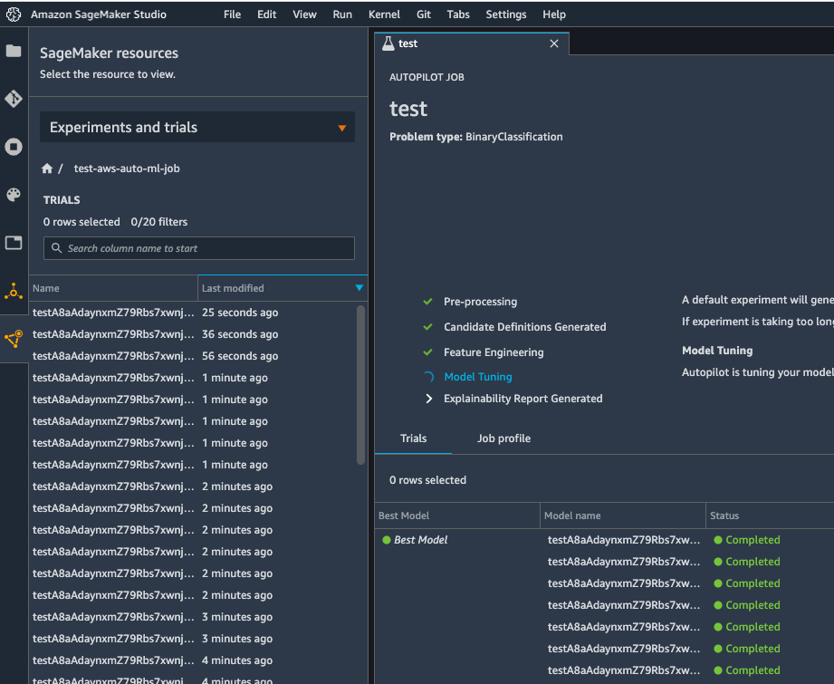

For each trial, you can view the trial components by righ-clicking **Open in trial component list**

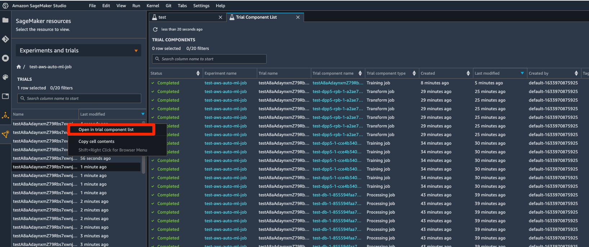

7. Compare and Analyze Trials

Select a group of trails that you plan to analyze. Make sure to select **Metrics** shown below:

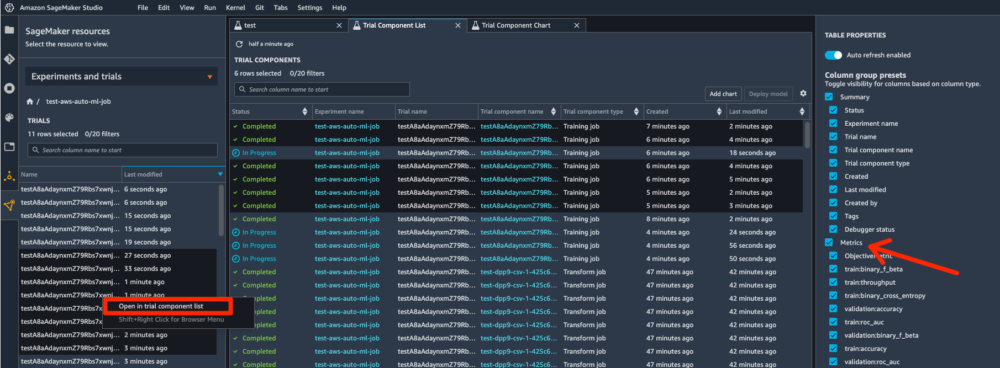

Sort the table entries based on **Validation:roc_auc**, and click **Add chart**

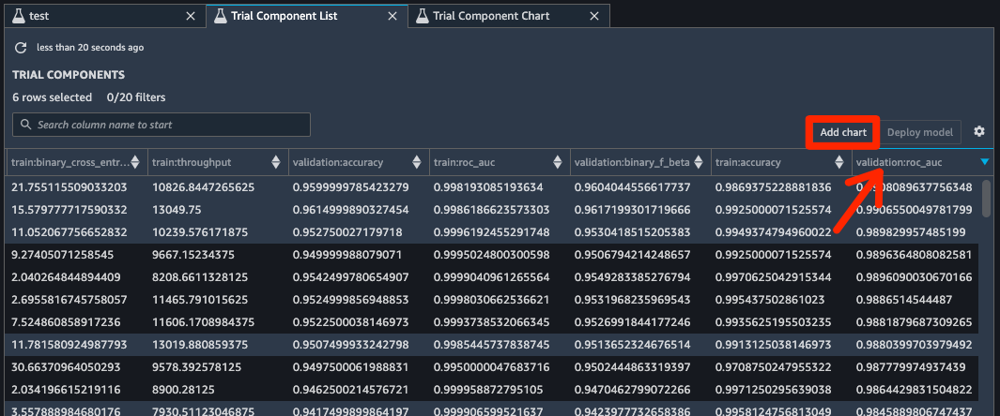

On the new window, click **Add chart**

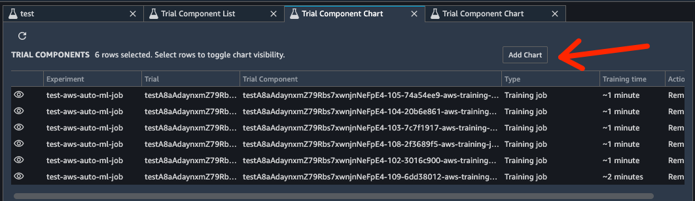

You can plot a bar-chart of  **validation:roc_auc_max**

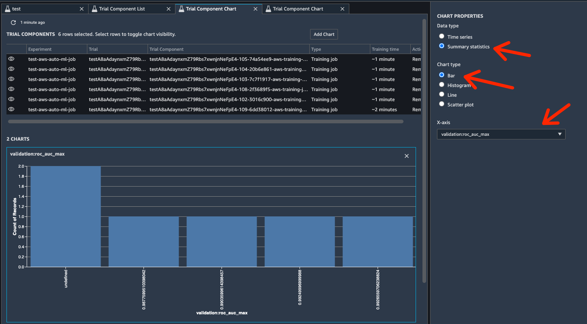